# 📊 Smart Finance Dashboard

An AI-powered forecasting dashboard for stock market and crypto analysis using deep learning and technical indicators — built with Python, Streamlit, and Firebase.

---

## 🚀 Features

- ⏱️ Real-time price forecasting using deep learning (LSTM)
- 📉 Technical indicators: EMA, RSI, MACD, ADX, Bollinger Bands
- 📊 Buy/Sell recommendations using CatBoost classifier
- 🔄 Volatility analysis & return distribution histograms
- 🧾 Export full forecast reports in PDF format
- ☁️ Firebase integration for session logging or data storage

> ⚠️ This dashboard includes **multiple AI-based forecasting modules**, each with **its own model, source code logic, and data source**.
> Forecast results and recommendations vary across modules depending on the strategy, AI model, and market data source.

---

## 🧰 Tech Stack

- **Frontend**: Streamlit
- **AI Models**: LSTM (TensorFlow/Keras), LightGBM, CatBoost
- **Data APIs**: TwelveData, Alpha Vantage, Yahoo Finance
- **Storage**: Firebase, Pickle, JSON

---

## 🧪 How to Run Locally

```bash
git clone https://github.com/izzeldeennahla/smart-finance-dashboard.git
cd smart-finance-dashboard
python -m venv .venv
source .venv/bin/activate  # or .venv\Scripts\activate on Windows
pip install -r requirements.txt
```

### Add a `.env` file:
```env
FIREBASE_API_KEY=your_key
FIREBASE_AUTH_DOMAIN=your_project.firebaseapp.com
...
```

### Then run the app:
```bash
streamlit run smart_finance_app.py
```

---

## 🌐 Deploy on Streamlit Cloud

1. Visit [streamlit.io/cloud](https://streamlit.io/cloud)
2. Connect your GitHub and select the repo
3. Set `smart_finance_app.py` as the main file
4. Click **Deploy**

---

## 📸 Application Screenshots

### 🧭 Sidebar Menu
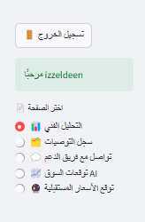

### 🔍 Stock Symbol & Filters
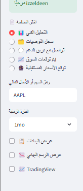

### 📊 Technical Analysis View + TradingView Chart
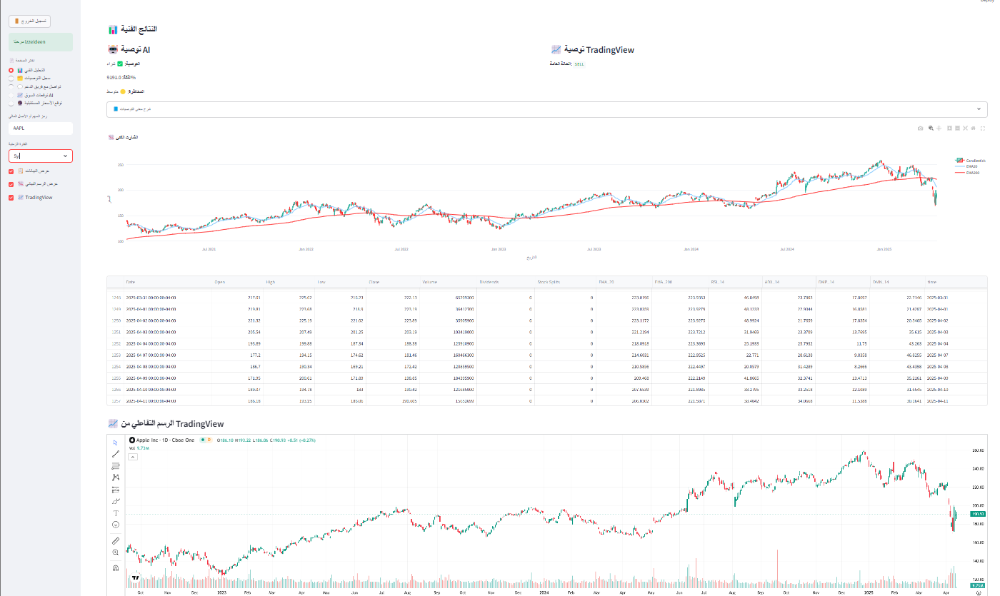

### 📋 Recommendations Log
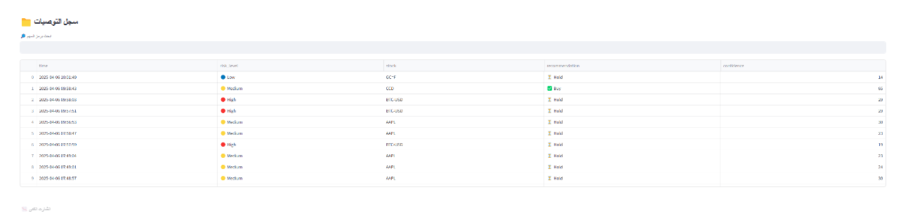

### 📬 Contact Support Page
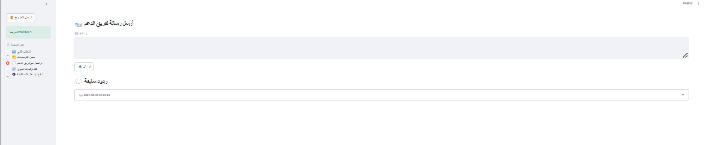

### 🤖 AI Market Forecast Page
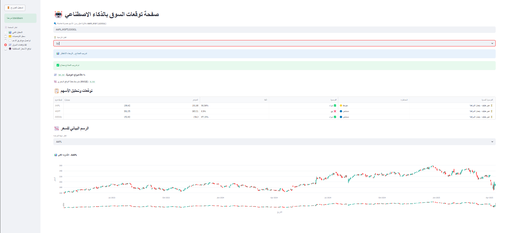

### 📈 Forecast Summary View
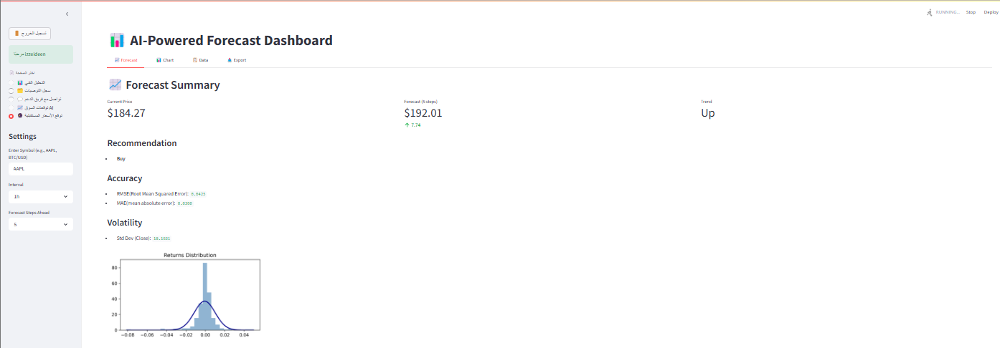

### 💹 Interactive Chart
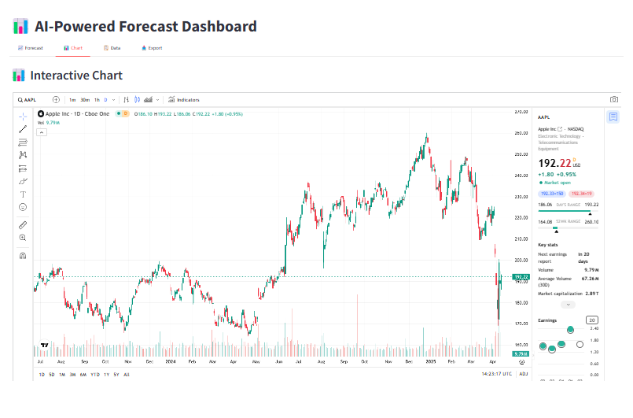

### 🧮 Raw Data Table
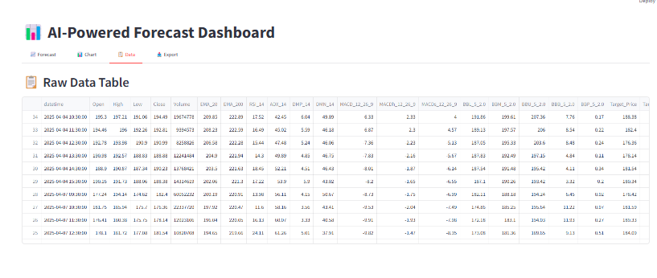

### 📨 Export PDF Section
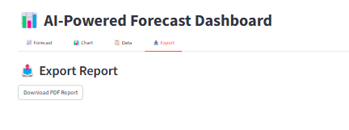

### 📄 Forecast PDF Report Sample
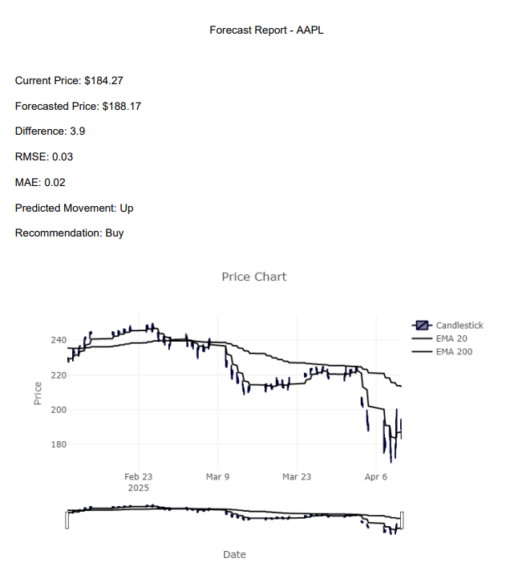

### 📊 Prediction vs Reality + Standard Deviation
 — feel free to contribute or star ⭐ this project.

---

## 🪪 License

Open-source under the MIT License.
